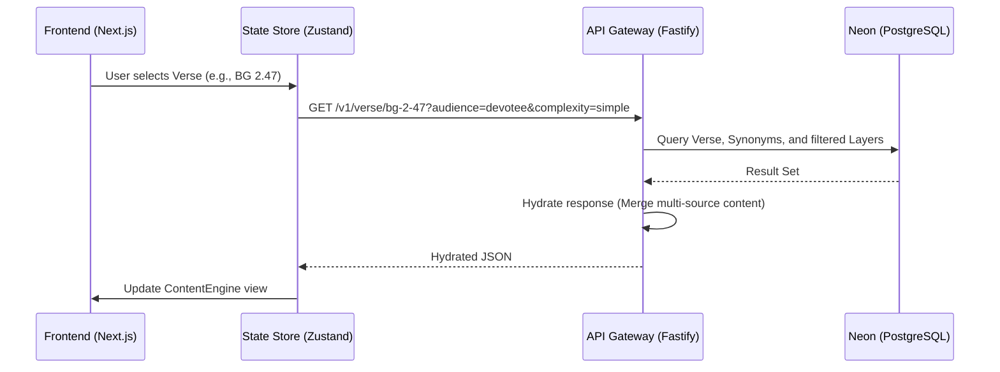

# Data Flow Overview

This document describes how data flows between the Frontend, API Gateway, and PostgreSQL Database.

## 1. Request Lifecycle

## 2. Component Interaction

### Tree Navigation -> Content Engine
When a node in the `TreeNavigation` is clicked, the `currentNodeId` is updated in the Zustand store. This triggers an effect that fetches the verse data from the API (or cache).

### Content Engine -> Tool Panel
The `currentVerse` object is shared across the layout. The `ApplicationPanel` (Right Panel) listens to changes in `currentVerse` to display relevant context tools, notes, and cross-references.

## 3. State Persistence

- **Navigation State**: Current scroll position and expanded nodes are kept in memory (Zustand).
- **User Interactions**: Notes and Highlights are currently saved to `localStorage` (via Zustand persistence) but will eventually be synced to the database via the `api-gateway`.
- **Content Cache**: Fetched verses are cached in the store to prevent redundant network requests.

## 4. Environment Configuration

- **Development**: `api-gateway` runs on `localhost:3001`, `web-library` on `localhost:3000`.
- **Production**: Vercel handles the frontends, and a cloud provider (e.g., AWS/GCP) or Vercel Functions handles the API gateway, connecting to Neon's serverless PostgreSQL.
